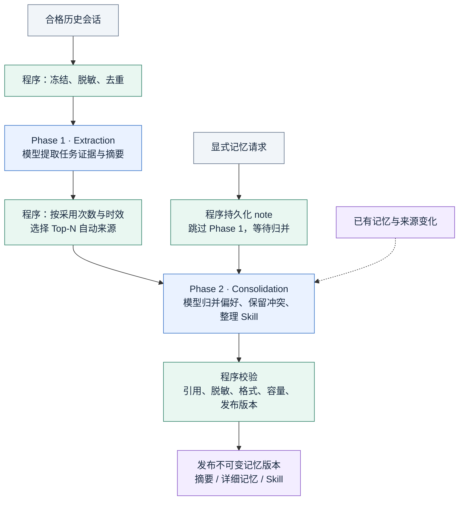
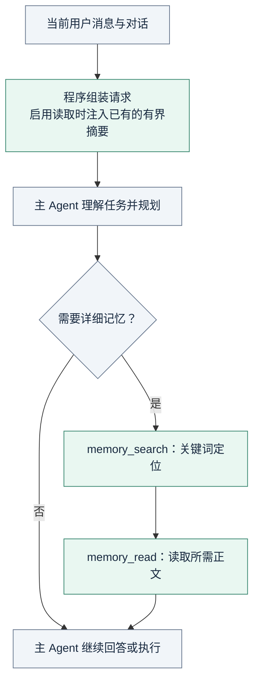
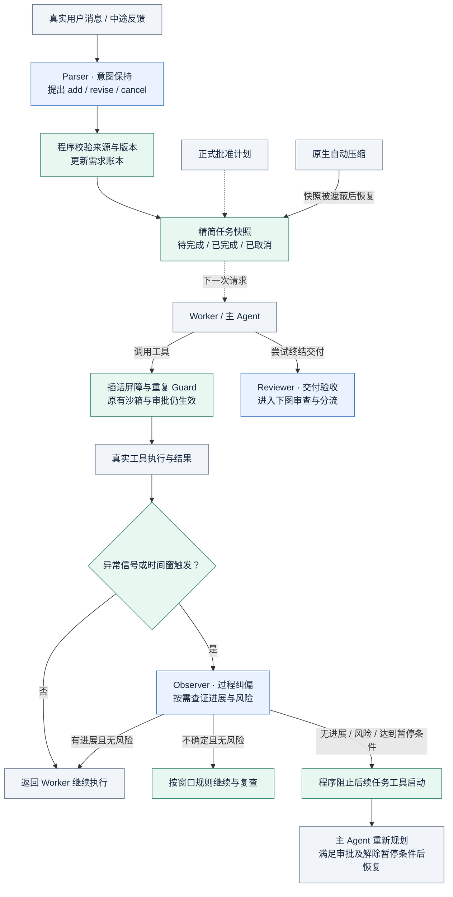
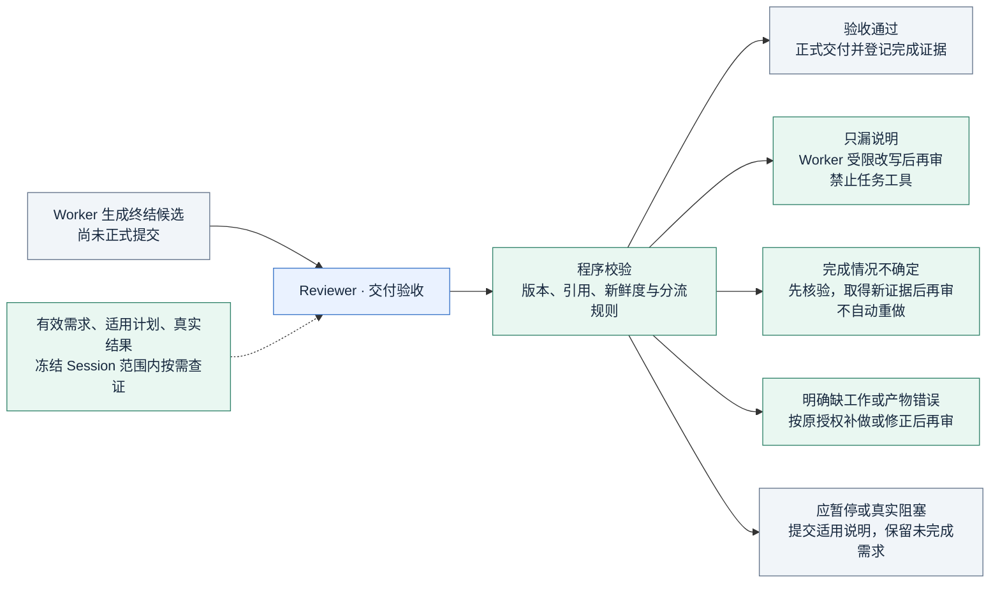

# DSH 智能体增强系统

[项目首页](README.md)

## 项目简介

基于开源 [DeepSeek Harness](https://github.com/deepseek-ai/deepseek-harness) 二次开发，保留 Cordis 插件化架构，围绕两类问题增强 Agent：跨会话的偏好与经验难以持续复用，以及长任务在多次反馈、上下文压缩和反复调查后容易遗漏要求或偏离目标。

- **长期记忆**：将历史会话中的有效证据沉淀为可追溯记忆，通过摘要注入与按需检索复用。
- **长任务治理**：通过“意图保持—过程纠偏—交付验收”三个辅助节点，连接需求状态、执行证据与最终回答。

当前为个人开发快照，不是稳定发布版本。长任务审查默认采用 Shadow（仅观察）模式；下图中的拦截与补救流程需显式启用 Enforce。

## 一、长期记忆：Memory Pipeline

写入侧采用异步 **Extraction → Consolidation** 两阶段流水线；读取侧采用 **摘要注入 + Agentic RAG**，不把完整历史会话塞入每次请求。



Scheduler 在后台协调来源发现、两阶段处理与重试。显式 note 单独参与归并，不被自动来源的 Top-N 排名挤掉。



### 写入：先保留证据，再决定沉淀什么

| 阶段 | 输入与输出 | 核心策略 |
| --- | --- | --- |
| **Phase 1 · Extraction** | 历史 rollout 快照 → 任务级证据、归并素材与任务摘要 | 有界并行处理合格来源，排除重复历史并脱敏；从用户原文提取偏好和纠正，从工具结果提取验证事实，保留来源与适用条件。只提取证据，不直接决定是否进入正式记忆。 |
| **Phase 2 · Consolidation** | 有效来源、已有记忆及显式记忆请求 → 新记忆版本 | 程序按来源被采用次数与时效筛选 Top-N，模型跨会话归并同义偏好、保留未决冲突；移除失去来源支持的内容，将重复且经过验证的流程整理为 Skill。 |
| **校验与发布** | 模型归并结果 → 可读取的不可变版本 | 程序校验引用、脱敏、格式与容量后发布；保留来源追溯关系，防止迟到结果覆盖更新的版本。 |

正式记忆分层存储：`memory_summary.md` 提供高密度摘要与主题入口，`MEMORY.md` 保留详细经验及适用范围，Skill 保存可复用步骤。显式“记住／修改／忘记”请求持久化后跳过 Phase 1，等待后续归并；保存请求不等于立即发布新记忆。

### 读取：摘要定位，工具查细节

- **请求组装**：在启用读取且存在正式记忆时，将有界摘要注入系统上下文，并记录实际使用的版本。
- **按需召回**：主 Agent 根据任务规划关键词，通过 `memory_search`、`memory_read` 查找详细记忆与 Skill；自包含任务可跳过检索，遇到熟悉错误或执行受阻时可在预算内二次检索。
- **可视化管理**：支持查看、逐条编辑和删除记忆，分别控制会话的记忆读取与贡献；变更经归并发布，不直接改写已发布文件。

历史记忆是参考数据，不是执行授权。当前用户要求、实际代码与最新工具结果优先于历史偏好和旧经验。详见[长期记忆架构](docs/subsystems/memory.zh.md)与[记忆配置](packages/memory/memory-bundle/README.zh.md)。

## 二、多需求长任务治理

不替换主 Agent 的规划与工具执行循环，而是在输入、执行过程和正式交付三个位置增加辅助判断。**模型负责理解语义，程序负责版本、引用与执行控制。**



执行循环图中的“返回 Worker”和“恢复”均指向同一个主 Agent，不增加模型角色。交付审查单独展开如下：



灰色表示原生主 Agent、沙箱审批、工具执行与压缩能力；蓝色表示三个新增辅助模型节点；绿色表示不调用模型的状态管理与执行控制。虚线表示状态或证据输入，实线表示执行流。

### 三个节点分别负责什么

| 节点与时机 | 主要输入 | 输出与作用 |
| --- | --- | --- |
| **Parser · 意图保持**：领取新用户消息后、主 Agent 请求前 | 当前用户原文、未取消需求、适用的批准计划 | 只提出 `add / revise / cancel`、需求正文与验证类型。程序绑定真实来源，校验目标和版本后更新账本；没有新消息不重复调用。 |
| **Observer · 过程纠偏**：异常信号或执行时间窗触发 | 当前需求与计划、触发原因、窗口内工具结果入口 | 按需读取证据，输出进展、风险、证据引用与简短理由。识别空转、跑偏或关键假设风险后，由程序暂停任务工具，再由主 Agent 重新规划并按审批恢复。 |
| **Reviewer · 交付验收**：正式最终回答提交前 | 全部有效需求、适用计划、候选回答与真实结果证据 | 分别判断回答是否覆盖、工作是否有证据、结论是否过度；输出逐项结果与缺口，由程序选择提交、改写、核验、补做或暂停。 |

三个节点是独立调用角色，不要求使用不同型号的模型；它们不替主 Agent 执行业务工具，也不拥有额外授权。

### 状态、证据与补救如何配合

- **版本化需求账本**：以 append-only Session Log 为依据；修改保留需求 ID、递增版本并清除旧完成判定，取消保留历史。迟到的解析或审查不能覆盖后续用户纠正。
- **压缩后恢复**：需求或批准计划变化时生成精简快照；快照被上下文压缩遮蔽后，在下一次主 Agent 请求前重新注入。快照展示待完成、已完成和已取消要求，不复制整份审计日志。
- **有条件地观察**：完全重复调用及结果、连续失败、交替重复和执行时间窗触发检查，而不是每个 Step 都调用 Observer。确定性 Guard 与语义判断分开：严格重复第三次提醒，第四次在工具实现启动前拦截；可信正常轮询按独立策略处理。
- **以适用证据验收**：辅助模型通过冻结的 `session_event_search / session_event_read` 按需查证；程序核对真实结果、需求版本、回答片段及证据新鲜度。工具成功不等于验收成功，代码修改后的旧测试不能自动证明最终版本。
- **缺口分流**：只漏说明就限制性改写；完成情况不确定先核验；明确缺工作或产物错误才按原授权补做或修正。正式回答提交后才登记通过的完成证据，避免“找不到证明”触发盲目重复操作。

插话屏障阻止旧请求启动尚未执行的任务工具，但不承诺撤销已发生的副作用。所有控制继续服从原有沙箱、审批与取消机制；模型判断不构成任务完整性保证。详见[长任务可靠性架构](docs/subsystems/task-contract-final-gate.zh.md)与[审查插件配置](packages/experimental/task-review-bundle/README.zh.md)。

<a id="run"></a>

<a id="run-from-source"></a>

## 从源码运行

准备 Node.js 24 或更高版本，以及项目声明的 pnpm 版本。运行：

```powershell
git clone https://github.com/KK456701/my_deepseek-harness.git
cd my_deepseek-harness
pnpm install
pnpm run build
pnpm dsh web
```

`pnpm run build` 准备运行产物，`pnpm dsh web` 使用构建后的产物启动界面。模型提供方与凭据配置参见 [Web 使用指南](docs/user/guide/index.zh.md)。本仓库的增强代码不等同于 npm 上的官方发行包。

长期记忆与长任务审查分别配置；包含对应代码并不代表所有功能已默认启用。启用前请阅读各自的配置与限制说明。

## 中文文档导航

- [Web 使用指南](docs/user/guide/index.zh.md)
- [长期记忆架构](docs/subsystems/memory.zh.md)
- [记忆配置](packages/memory/memory-bundle/README.zh.md)
- [长任务可靠性架构](docs/subsystems/task-contract-final-gate.zh.md)
- [审查插件配置](packages/experimental/task-review-bundle/README.zh.md)
- [整体架构](docs/architecture.zh.md)
- [开发指南](docs/development.zh.md)

## 数据与开发状态

仓库包含功能源码、必要测试和使用说明，不包含个人凭据、私人会话日志、记忆数据库或内部评测材料。开发快照保留已知检查问题，不作为生产可用性承诺。

## 上游与许可证

本项目基于 DeepSeek AI 开发的 DeepSeek Harness，底层插件架构由 [Cordis](https://github.com/cordiverse/cordis) 支持。保留上游历史、归属说明与 [MIT 许可证](LICENSE)；第三方依赖及许可证见 [THIRD_PARTY_NOTICES.md](THIRD_PARTY_NOTICES.md)。
